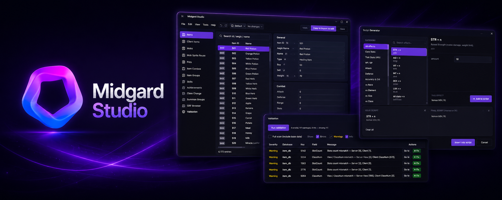

<div align="center">



# Midgard Studio

**The Ragnarok Server Studio.**
A native Windows editor for Ragnarok Online private servers — server databases and client data, side by side, in one app.

</div>

---

Midgard Studio edits the YAML databases your server reads (items, monsters, skills, pets, groups, combos…) **and** the client files players see (item text, icons, sprites, map cache) — without ever touching your base files. Every change lands in your **import layer**; your original `re/` and `pre-re/` data stays pristine and upgrade-safe.

It's a desktop app, not a web tool. No accounts, no cloud, no install. Point it at your server, and edit.

> [!NOTE]
> Compatible with rAthena-style YAML databases. Renewal and Pre-Renewal both supported.

## What it does

- **Edit every core database** in a generated, schema-driven form — no hand-writing YAML, no breaking indentation.
- **Override safely.** Editing an official entry clones it into `import/`; the base file is read-only. Your customizations survive a server update.
- **Forge complete custom items** — server stats, client text, slots, icon and headgear sprite — in one guided flow.
- **Browse your GRF** read-only, with previews for images, sprites, maps, models, lua and more.
- **Catch mistakes before you deploy** with cross-file validation (View ↔ ClassNum, Slots ↔ slotCount, dangling references).
- **Full undo/redo**, dated backups, and three save modes (manual, timed, on-edit).
- **Fluent dark UI**, instant search across any database, and remappable shortcuts.

## What it edits, and where it writes

Your base data is never modified. Edits go to the import/custom layer only:

| You edit | Written to |
| --- | --- |
| Server databases (items, mobs, skills, pets, combos, groups, …) | `server-db/db/import/<db>.yml` |
| Client item text & resources | `SystemEN/itemInfo_C.lua` (`tbl_custom` / `tbl_override`) |
| Sprite registration (headgear, monsters) | `lua-files/datainfo/*.lub` |
| Map cache | `server-db/db/import/map_cache.dat` |

Supported databases: **Items**, **Mobs**, **Mob Sprite Reuse**, **Pets**, **Skills** (full SKILL_DB v4), **Item Combos**, **Item Groups**, **Achievements**, **Class Change** (Abracadabra), **Summon Groups** — plus the **Map Cache** editor.

## Get it

Download `Midgard Studio.exe` from the [**Releases**](../../releases) page. It's a single self-contained file (~73 MB) — **no installer, no .NET to set up**. Double-click and run.

**Requirements:** Windows 10 / 11 (x64).

Prefer to build it yourself? See [Build from source](#build-from-source).

## First run — connect it to your server

On first launch you'll land in **Profiles & configuration** (also at `Ctrl+,`). A profile tells Midgard Studio where your files live:

| Setting | Point it at |
| --- | --- |
| **Server DB root** | Your server's `db` folder (the one containing `re/`, `pre-re/`, `import/`) |
| **Client item info** | `itemInfo.lua` (official base) and `itemInfo_C.lua` (your custom file) |
| **Client lua data** | Your loose `lua-files` / `datainfo` folder |
| **GRF / data sources** | Your client `.grf` archives (optional — enables icon & sprite previews) |

Save the profile and you're in. You can keep **multiple profiles** (one per server) and switch between them from **File → Switch profile**. Set the ruleset under **View → System → Renewal / Pre-Renewal** at any time.

## How your files are treated

This is the part that matters, so it's explicit:

- **Base data is read-only.** `re/`, `pre-re/` and the official `itemInfo.lua` are never written. Your edits go to the import layer only.
- **Writes are crash-safe.** Each file is written to a temp file, the previous version is backed up, then the file is atomically swapped — a power cut can't leave a half-written database.
- **Hand-written content is preserved.** Edits are spliced into your existing `itemInfo_C.lua`; your helper functions, comments and untouched entries are kept byte-for-byte.
- **Client encoding is respected.** Client lua is written in the client's Windows-1252 codepage, so the "Korean-looking" resource names round-trip exactly. Text that can't be represented is rejected with a clear message instead of being silently mangled.
- **Your GRF is never written.** Sprite and lua edits are exported as loose files into a `data\` folder mirroring the GRF's internal path — you pack them into your GRF yourself, on your terms.

## Keyboard shortcuts

| Action | Shortcut |
| --- | --- |
| Save | `Ctrl+S` |
| Undo / Redo | `Ctrl+Z` / `Ctrl+Y` |
| Quick open (jump to any entry) | `Ctrl+K` |
| Profiles & configuration | `Ctrl+,` |

All shortcuts are remappable in **Settings → Shortcuts**.

## Build from source

**Prerequisites:** Windows and the [.NET 8 SDK](https://dotnet.microsoft.com/download/dotnet/8.0) (newer SDKs are fine as long as the `net8.0` targeting pack is installed).

**Build, test, run**

```sh
dotnet build  MidgardStudio.slnx -c Debug
dotnet test   tests/MidgardStudio.Tests/MidgardStudio.Tests.csproj
dotnet publish src/MidgardStudio.App/MidgardStudio.App.csproj /p:PublishProfile=win-x64
```

The publish output is a self-contained, single-file x64 build at
`src/MidgardStudio.App/bin/publish/win-x64/Midgard Studio.exe`.

## Project structure

```
MidgardStudio/
├─ src/
│  ├─ MidgardStudio.Core   # schemas, base/import overlay, YAML + lua (de)serialization, undo stack — no UI
│  ├─ MidgardStudio.Grf    # read-only GRF access (wraps the Tokeiburu GRF library)
│  └─ MidgardStudio.App    # WPF UI (.NET 8, WPF-UI Fluent / Mica dark theme)
├─ tests/MidgardStudio.Tests   # xUnit; runs headless against real data with golden round-trips
└─ MidgardStudio.slnx
```

## FAQ

**Will it break my server's files?**
No. Base files are opened read-only; edits go to `import/` and `itemInfo_C.lua`, written atomically with a backup and a dated snapshot. There's full undo, and you can restore any backup.

**Do I need a GRF?**
No — it's optional. Without one you simply won't get icon/sprite previews; every editor still works.

**Renewal or Pre-Renewal?**
Both. Toggle under **View → System**; the editor shows the right ruleset and reads the matching base data. Each profile remembers its default.

**Where do my custom client files go for packing?**
Into a loose `data\…` folder that mirrors the GRF layout. Midgard Studio never edits your `.grf` — you pack the exported files yourself.

## Credits

Built by **Kyoshio**.
GRF reading via [Tokeiburu's GRF Editor library](https://github.com/Tokeiburu/GRFEditor) (vendored in [`lib/grf/`](lib/grf)). UI built on [WPF-UI](https://github.com/lepoco/wpfui).

## License

[MIT](LICENSE) with the [Commons Clause](https://commonsclause.com/) — free to use, modify, and self-host; you may not sell the software itself. © 2026 Kyoshio.
